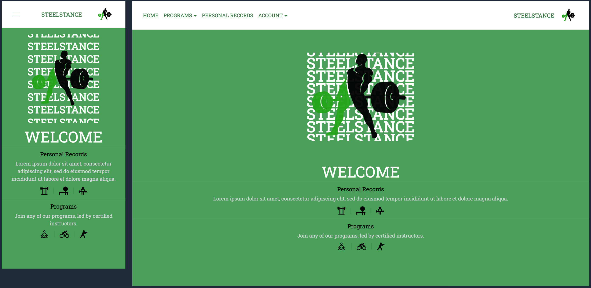

This is a [Next.js](https://nextjs.org/) project with a backend powered by [Flask and SQLAlchemy](https://flask-sqlalchemy.palletsprojects.com/en/3.1.x/) and Tailwind CSS for UX.

[Click here to visit the site](https://fitness-app-ousamuel.vercel.app/)
# SteelStance

[](https://raw.githubusercontent.com/ousamuel/fitness-app/main/images/home-ss.png)

## Introduction
Welcome to SteelStance, a full-stack fitness application developed using the framework Next.js with a Flask backend. Users can calculate their BMI on the home page, view other users' personal records for powerlifts (squat, bench, deadlift) and view different workout programs.

After signing up/logging in through authentication, users can submit their own personal records and save workout programs, both viewable in their profile page. Users can edit their account information (username, email, height, weight) and delete their profile. If their profile is deleted, their personal records are also deleted.

(The database is pre-seeded with sample data for programs and 5 users with personal records).

## Features
- Custom-built User Authentication
- User Login/Sign Up
- Edit & Delete Profile
- Viewing Other Personal Records (sortable through various categories)
- Post Personal Records
- Save/Unsave Workout Programs

Front-end Integrations:
- Formik for form management
- useContext for state management
- NextUI library for UI components

Back-end Integrations:
- User authentication via Flask-Login and Flask-Bcrypt for secure session management and password hashing
- Object-relational mapping utilizing SQLAlchemy
- RESTful API with full CRUD + CORS for cross-origin requests


## Acknowledgements
- [NextUI](https://nextui.org/)
- [SVG Vectors/Icons](https://www.svgrepo.com/)

## To run this repository on your local machine: 

Clone the repository
```bash
git clone git@github.com:ousamuel/fitness-app.git
```

Install all required dependencies
```bash
chmod +x setup.sh
bash setup.sh
```

Open two different terminals

Terminal 1: cd into the 1-next directory
```bash
npm run dev
```
Terminal 2: cd into the 2-flask directory
```bash
python app.py
```
To re-seed the database with sample data:
```bash
python seed.py
```


Open [http://localhost:3000](http://localhost:3000) with your browser to see the result.

Sample User Logins(1-5):
- email: user1@gmail.com
- password: user1pass

By default:
Next.js server is ran on port 3000 & Flask application on port 5500 


<!-- 
Open [http://localhost:3000](http://localhost:3000) with your browser to see the result.


[API routes](https://nextjs.org/docs/api-routes/introduction) can be accessed on [http://localhost:3000/api/hello](http://localhost:3000/api/hello). This endpoint can be edited in `pages/api/hello.js`.

The `pages/api` directory is mapped to `/api/*`. Files in this directory are treated as [API routes](https://nextjs.org/docs/api-routes/introduction) instead of React pages.

This project uses [`next/font`](https://nextjs.org/docs/basic-features/font-optimization) to automatically optimize and load Inter, a custom Google Font.

## Learn More

To learn more about Next.js, take a look at the following resources:

- [Next.js Documentation](https://nextjs.org/docs) - learn about Next.js features and API.
- [Learn Next.js](https://nextjs.org/learn) - an interactive Next.js tutorial.

You can check out [the Next.js GitHub repository](https://github.com/vercel/next.js/) - your feedback and contributions are welcome!

## Deploy on Vercel

The easiest way to deploy your Next.js app is to use the [Vercel Platform](https://vercel.com/new?utm_medium=default-template&filter=next.js&utm_source=create-next-app&utm_campaign=create-next-app-readme) from the creators of Next.js.

Check out our [Next.js deployment documentation](https://nextjs.org/docs/deployment) for more details.
# Pokefun

## Instructions

- Go to https://pokefun.vercel.app/
- Create a profile through Auth0
- Enjoy the features of the app

## Introduction

- PokeFun is an app built of love for Pokemon. Shoutout to Satoshi Tajiri, the creator of Pokemon for giving us something wonderful and amazing. As of 6-1-23, this app only shows gen 1 Pokemon. Some details are for future ideas.

### Features

- Auth0 login
- Edit/delete your profile
- Play a mini game to collect coins
- Use the coins to collect Pokemon
- See other users
- Links to my Github, LinkedIn and Medium

## Conclusion

- As the capstone for my Flatiron journey, I wanted to showcase everything I learned through the course. I used Next.js and Prisma as the setup for this project and Tailwind + CSS for UX.

## Resource

- Satoshi Tajiri - for Pokemon
- instructor Antonio Reid
- instructor Dj
- https://projectpokemon.org/home/docs/spriteindex_148/3d-models-generation-1-pok%C3%A9mon-r90/
- https://pokemon.fandom.com/wiki/Category:Generation_I_Pok%C3%A9mon
- https://www.serebii.net/pokemon/gen1pokemon.shtml
- cohort student Erkut Cakmak
- uiverse.io -andrew-demchenk0 -->